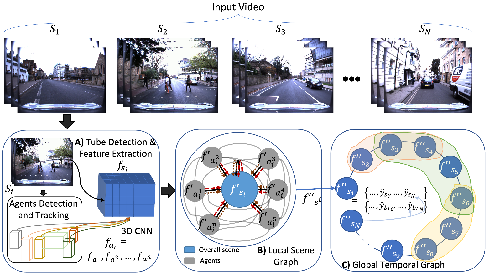

# A Hybrid Graph Network for Complex Activity Detection in Video

<!--  -->

## Overview
Complex Activity Detection (CompAD) is an important computer vision task with direct applications to a variety of domains, including autonomous driving and sports analytics. CompAD can be seen as the advanced version of Temporal Action Localisation (TAL), which aims to recognise what actions take place in a video and identify their start and end time. While TAL mostly focuses on short-term actions, CompAD extends the analysis to long-term activities, and does so by modeling a complex video activity’s internal structure. In this paper, we address the CompAD problem using a hybrid graph neural network which combines attention applied to a graph encoding the local (short term) dynamic scene with a temporal graph modelling the overall long-duration activity. Our contribution is threefold. i) Firstly, we propose a novel feature extraction technique which, for each video snippet, generates spatiotemporal ‘tubes’ for the active elements (‘agents’) in the (local) scene by detecting individual objects, tracking them and then extracting 3D features from all the agent tubes as well
as the overall scene. ii) Next, we construct a local scene graph where each node (representing either an agent tube or the scene) is connected to all other nodes. Attention is then applied to this graph to obtain an overall representation of the local dynamic scene. iii) Finally, all local scene graph representations are temporally connected to each other via a temporal graph, with the aim of estimating the complex activity class together with its start and end time. The proposed framework outperforms all previous state-of-the-art methods on three benchmark datasets: Thumos-14, ActivityNet-1.3, and the more recent ROAD


## Requirements
We need three things to get started with training: datasets, Feature extraction from the dataset, and pytorch with torchvision and tensoboardX. 

## Datasets

### ROAD

### ActivityNet-1.3

### Thumos-14

## Features Extraction
For all three dataset we already extracted the features and can be downloaded from here

## Training the model

```
python main.py --Data_Root=Datasets --Save_Root=Trained_models --Mode=train --Dataset_Name=Thumos --Seq_Len=30 --Edge_Type=scene --Inp_Feat_Len=2048 --No_of_Classes=21 --Aggregate_All=False --Epochs=500 --Train_Batch_Size=600 --Test_Batch_Size=600
```

### Arguments
```
--Data_Root=Datasets        --->  Path to the datasets where the features are saved
--Save_Root=Trained_models  --->  Path for saving the trained models
--Mode=train                --->  train or test
--Dataset_Name=ROAD         --->  Datasets are ROAD, Activitynet, and Thumos        
--Seq_Len=30                --->  Sequence supported by our system are 12, 18, 24, and 30
--Edge_Type=fully_connected --->  Three types of edges; fully_connected scene scene_same_label
--Inp_Feat_Len=2048         --->  For our features the len is 2048, please change it if you are using your own features
--No_of_Classes=7           --->  No_of_classes are 7,21, and 200 in ROAD, Thumos, and ActivityNet
--Aggregate_All=False       --->  Using the agreegation of all nodes or only scene node
--Epochs=500                --->  Number of epochs
--Train_Batch_Size=600      --->  Length of the temporal graph at training time
--Test_Batch_Size=600       --->  Length of the temporal grpah at test time
```

## Visualisation
<!-- 


 -->
